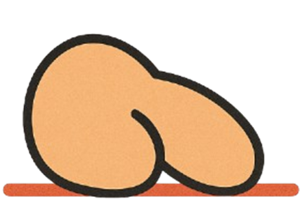

# 🔥 Burne Down Chart™

> La première métrique agile qui mesure **vraiment** l'épuisement de vos développeurs.

## 📊 Qu'est-ce que c'est ?

La Burne Down Chart™ révolutionne le management agile en transformant votre bon vieux burn-down classique en un indicateur de virilité projectuelle scientifiquement subjectif.

## 🎯 Caractéristiques

- **Métrique innovante** : Mesure les Points de Burne Fictifs (PBF™)
- **Ultra-agile** : La courbe descend toujours (sinon c'est que vous sabotez le sprint)
- **100% humain** : Quantifie l'ego blessé, pas juste les tickets
- **Certification gratuite** : Pas besoin de formation à 3000€

## 🚀 Resources

### [📜 Le Manifeste Burne Down™](https://maximevernusset.github.io/Burne-Down/manifesto/index.html)

### 📜 Newsletters

#### [📉 Burne Down Chart™](https://maximevernusset.github.io/Burne-Down/newsletters/1/index.html)

Suivez en temps réel la courbe de motivation perçue de vos devs, exprimée en _points de burne fictifs_ (PBF™).

#### [🎭 Scrum Cringe Theater™](https://maximevernusset.github.io/Burne-Down/newsletters/2/index.html)

Un espace sécurisé pour rejouer et transcender vos pires moments agiles.

#### [💉 Programme Agiltox®](https://maximevernusset.github.io/Burne-Down/newsletters/3/index.html)

Protocole de désintoxication douce.

## 📄 Licence

[WTFPL](LICENCE) - Do What the F*ck You Want to Public License

---

_"Parce que votre motivation n'est jamais assez métriquée."_
— L'Équipe Agile Enablement Office™

